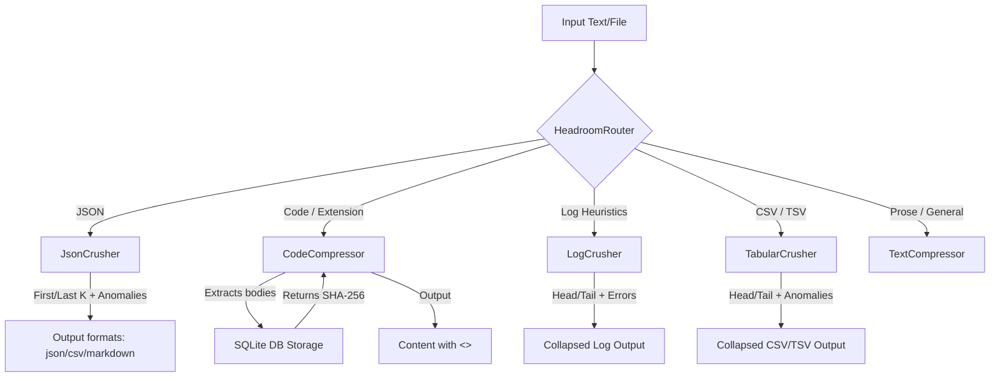

# Antigravity Headroom

Antigravity Headroom is a context-aware token compression utility designed to help Large Language Models (LLMs) handle massive files, logs, and codebases. By stripping and caching details in local SQLite storage, Headroom replaces boilerplate and long repetitions with short retrieval tokens (e.g., `<<ccr:hash,lang,size>>`) and highlights crucial anomalies (like compiler warnings, test failures, or runtime exceptions).

## Features

- **Decompression / Reconstruction Engine**: Recursively inflates and reconstructs tokenized files in-place or inline via the CLI/MCP server by replacing all `<<ccr:...>>` tags with their original cached values.
- **Lightweight CacheAligner**: Standardizes and normalizes volatile strings such as UUIDs (v4), ISO 8601 timestamps, date-time lines, and git commit hashes to static placeholders (e.g., `[UUID]`, `[DATETIME]`, `[COMMIT_HASH]`) to prevent prompt cache invalidation for LLM providers.
- **Tabular Crusher (CSV/TSV Compressor)**: Structural compression of spreadsheet rows. Preserves headers, keeps first/last $K$ rows, scans omitted middle rows for anomaly keywords (e.g. `error`, `fail`, `warn`), and retains TSV/CSV delimiters.
- **AST-Based Python Compression**: Strips Python method and function bodies and caches them, preserving method signatures and classes to maintain semantic structure.
- **Curly-Brace Language Regex Scanner**: Portable, tree-sitter-independent body compression for C/C++, JS/TS, Go, Java, and other bracket-based languages.
- **Log Crusher**: Collapses repetitive log messages, preserving the first/last $K$ lines and pinning any intermediate stack traces or errors with line indicators.
- **JsonCrusher (JSON Compressor)**: Statistical compression of large list structures (marketed as `SmartCrusher`). Always lexicographically sorts dictionary keys to ensure prompt caching compatibility. Keeps first and last $K$ elements, scans omitted middle elements for anomaly keywords, and formats output as JSON, CSV-Schema, or Markdown Key-Value pairs.
- **Thread-safe SQLite Caching**: Thread-safe storage with a configurable Time-To-Live (TTL, default 5 mins) to automatically clear expired context.
- **Footprint & Savings Statistics**: Tracks database hits, misses, hit ratios, and exact byte savings from compression.
- **BM25 Search Retrieval**: Search for closest cached content by query if a direct hash is unavailable.
- **Model Context Protocol (MCP) Integration**: Stdio-based server allowing LLM clients to dynamically compress, decompress, inspect, and retrieve code blocks.

---

## How It Works



1. **Alignment**: If `--align` is active, volatile tokens are mapped to static placeholders to optimize prompt caching.
2. **Routing**: The router inspects file extensions, mime-types, or performs content heuristics (such as matching equal column separators for tabular data) to determine which compressor to use.
3. **Caching**: Code bodies are extracted, hashed, and stored in a thread-safe SQLite database.
4. **Tokenization**: The original code is rewritten, substituting the body with a tag of the form `<<ccr:hash,lang,size>>`.
5. **Reconstruction**: Decompression scans the compressed output, query-fetching original components back to their original spots.

---

## Installation

```bash
pip install -e .
```

Alternatively, install dependencies directly:
```bash
pip install -r requirements.txt
```

---

## Usage

### Command Line Interface

```bash
# 1. Compress a python file with cache alignment enabled
headroom compress path/to/file.py --align

# 2. Decompress a tokenized file back to its original code
headroom decompress compressed_file.py

# 3. View compression savings, cache size, hit/miss ratios
headroom stats

# 4. Clean expired cache entries immediately
headroom stats --clean

# 5. Clear all database contents and reset statistics
headroom stats --clear

# 6. Compress a CSV file preserving header and anomalies
headroom compress data.csv --k-rows 3

# 7. Run a shell command safely, capturing and compressing its log output
headroom run "pytest -v"

# 8. Run a command with shell operators (like pipes/redirects) using the --shell flag
headroom run --shell "pytest -v && git diff"
```

### Model Context Protocol (MCP) Server

To run the MCP server over stdio:

```bash
headroom mcp
```

Exposed tools:
- `headroom_compress(text, filename, mime_type)`: Compresses inputs.
- `headroom_decompress(text)`: Reconstructs all `<<ccr:...>>` tokens in the text back to their original representation.
- `headroom_retrieve(token_or_hash, query)`: Retrieves individual blocks by hash or query.
- `headroom_stats()`: Exposes cache hit ratios and total byte savings.


---

## Token Reduction & Answer Quality (How it Works)

Antigravity Headroom achieves a delicate balance between **dramatic token savings (50% to 90%)** and **high answer quality** by using a reversible hybrid approach:

### 1. Token Savings Strategy
* **Code Compressor**: Strips method/function bodies leaving only class/method headers, imports, and docstrings. Replaces them with a small 80-byte token (`<<ccr:hash,lang,size>>`). This yields a **50% to 80%** reduction in code token size.
* **JsonCrusher**: Collapses lists of database items or files, preserving only the first/last $K$ elements and any detected errors/warnings. This yields a **70% to 90%** reduction in JSON payload tokens.
* **Log Crusher**: Strips repetitive loop lines in shell outputs, saving **70% to 90%** log tokens.
* **CacheAligner**: Replaces volatile dates, timestamps, and commit hashes with static placeholders, boosting prompt caching hit ratios on LLM providers.

### 2. Quality Preservation via Reversibility (CCR)
If text compression were irreversible, the LLM's answers would lose detail (e.g., it wouldn't know how a function is implemented). Antigravity Headroom solves this through **Context-Compressed Retrieval (CCR)**:
1. **Pristine Local Cache**: The original uncompressed source blocks are saved locally in the SQLite database.
2. **Skeleton Reasoning**: The LLM reads only the lightweight "skeleton" (signatures and structure) for its initial reasoning, saving massive token budgets.
3. **On-Demand Retrieval**: When the LLM decides it needs to modify a specific method, inspect a truncated log, or read database details, it calls the `headroom_retrieve` tool (or the CLI utility) using the token's hash. The original text is retrieved and injected back into the LLM's context on-the-fly.

This ensures the LLM retains **full-fidelity access to all details** while spending only a fraction of the token cost!

---

## Limitations / What It Cannot Do

To avoid false claims, please be aware of the following strict limitations:
1. **Lossy Compression**: Headroom *does not* perform lossless text compression (like Gzip/Zlib). The source text is modified. If you discard the SQLite database or allow the TTL to expire, the original details **cannot** be recovered.
2. **Local Scope**: Storage is bound to the local machine (`~/.antigravity_headroom.db` by default). Compressed tokens shared with other machines or remote LLM APIs will fail to retrieve unless they have access to the same SQLite database.
3. **Syntactic Validity**:
   - Python AST-based compression maintains syntactic validity because placeholders are correctly indented.
   - For other languages, the regex brace-matching parser matches curly braces. While highly robust, files with complex macro expansions or severely malformed syntax may result in invalid code structures after compression.
4. **Context Window Limitations**: While headroom dramatically reduces token footprint, if the original content is completely evicted via TTL, the LLM will not be able to retrieve it. Setting a higher TTL is necessary for long-running agent tasks.
